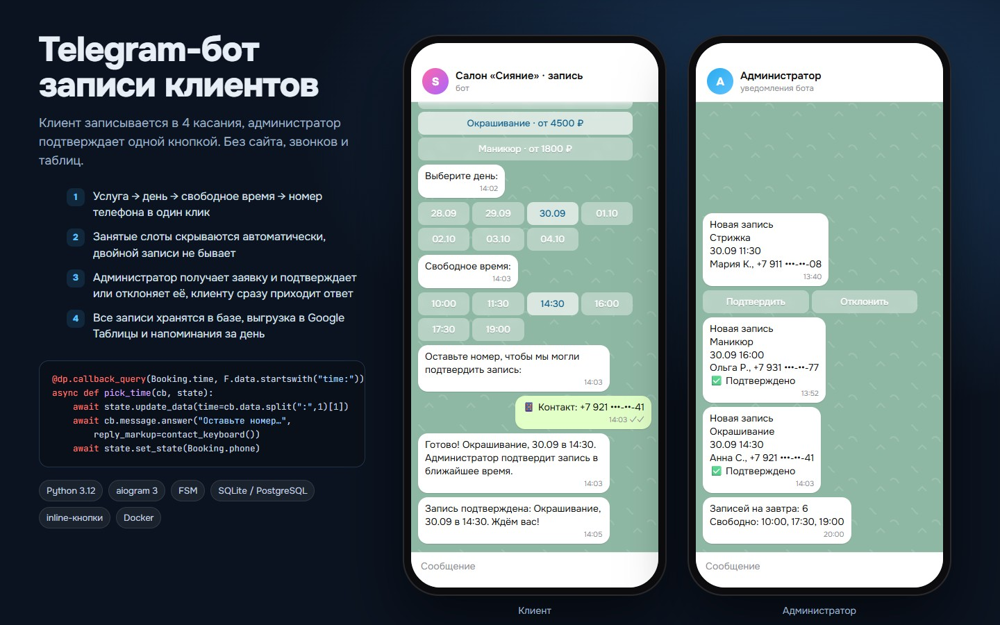
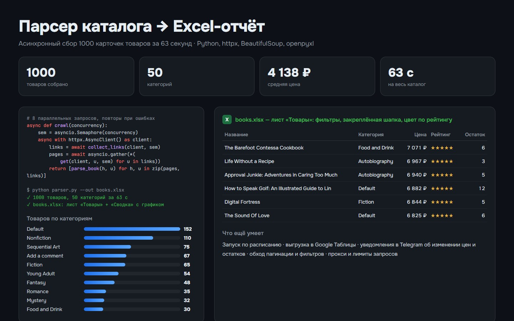
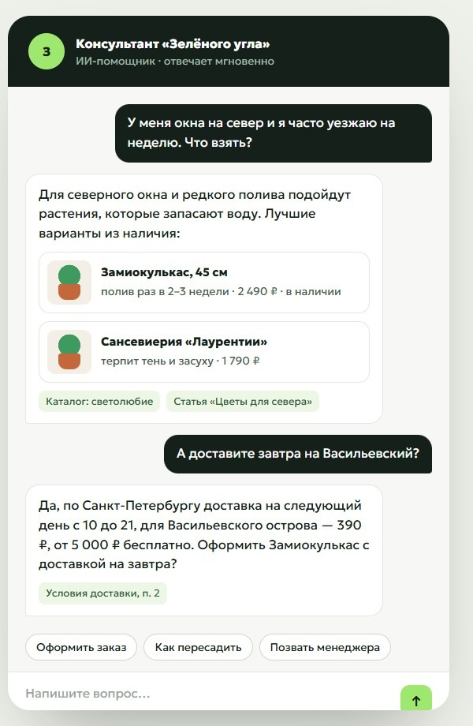
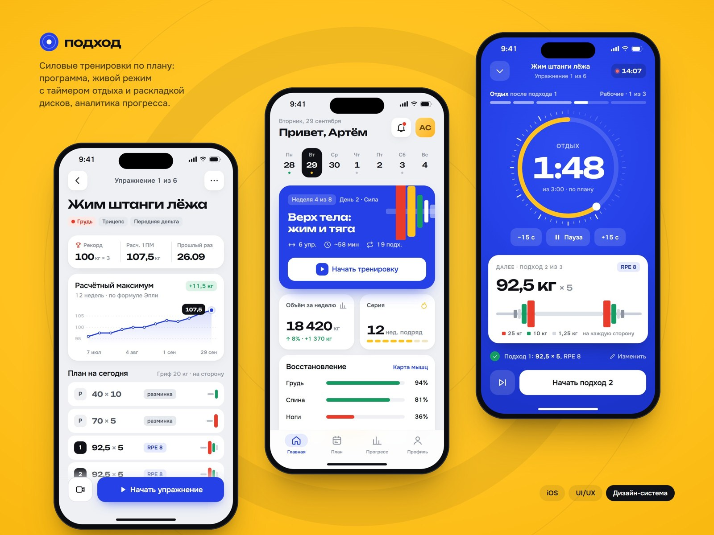
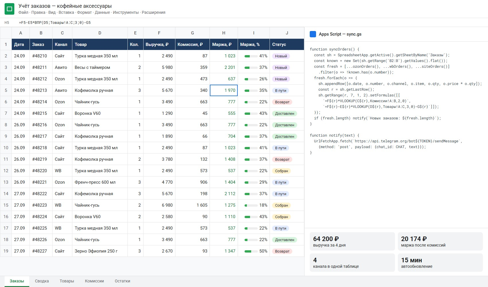

# python-automation

Bots, scrapers and spreadsheet automation for small businesses. Each folder is a self-contained tool for a common request: bookings, price monitoring, reporting.

| Booking bot | Catalog parser |
|---|---|
|  |  |
| **AI assistant over a knowledge base** | **Telegram Mini App** |
|  |  |

## booking_bot

Telegram bot for salons and clinics. The client picks a service, a day and a free slot, leaves a phone number; the admin gets the request with Approve / Decline buttons.

- aiogram 3, finite-state machine for the dialog
- SQLite storage, busy slots are hidden automatically so double booking is impossible
- the admin confirms or declines with one tap, the client gets the answer right away

```bash
pip install -r requirements.txt
BOT_TOKEN=... ADMIN_ID=... python booking_bot/bot.py
```

## catalog_parser

Async scraper that walks a paginated catalog, normalises prices and ratings and builds an Excel report with a summary sheet and per-category tabs.

- httpx with a connection pool and retries, BeautifulSoup parsing
- concurrency limited by a semaphore to stay polite to the target site
- openpyxl report with formatting and an HTML dashboard (`make_report.py`)

```bash
python catalog_parser/parser.py --pages 50 --out books.xlsx
```

## sheets_automation

Google Sheets sales tracker: formulas, conditional formatting, a weekly summary and Telegram notifications on new deals.


